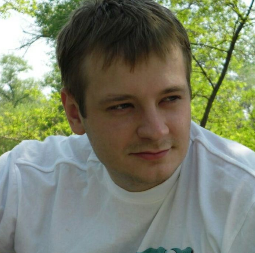

# 

# Eugen Sopilnyak

* **

## Contacts

* **Location**: Ukraine, Zaporozie;
* **Phone**: +38(095)8389571;
* **Email**: eugen.sopilnyak@gmail.com;
* **GitHub**: [@EugenES7](https://github.com/EugenES7);
* **LinkedIn**: [LinkedIn Profile](https://www.linkedin.com/in/eugen-sopilnyak-b83030236/);
* **Facebook**: [Facebook Profile](https://www.facebook.com/eugensopilnyak);
* **Discord**: **EugenES7#5429** _(nickname on Discord-server RS School)_

* **

## About me

Throughout my life I've always been interested in the exact sciences and technical disciplines.
I graduated the Engineering Academy, received a specialist degree and worked in the construction industry (started my career as a foreman, then worked my way up to a construction project manager).
Despite my experience, I was always interested in learning something new, so I decided to try myself at the IT field.
I've always been distinguished by  desire for self-improvement and acquiring new knowledge.
I take education very seriously and I'm not afraid of difficulties.
I always set high goals for myself and now the aim of my studies is to reach an excellent level of a front-end specialist within a year.

* **

## Skills

* **HTML5**
* **CSS3**
* **JavaScript** (Basic)
* **Git**
* **Windows OS**
* **Figma** (for web development)
* **Photoshop**
* **VSCode**
* **ArchiCAD/AutoCAD** (from my main specialty)

* **

## Сode example

```javascript
function multiply(a, b){
return a * b
}
```

* **

## Education

* **Zaporozhye State Engineering Academy**
    higher education, civil engineer;
* **WayUp**
    [Java Script](https://wayup.in/library/course18);
    [HTML/CSS](https://wayup.in/library/course10);
* **Stepik**
    [HTML/CSS](https://stepik.org/cert/1487220);
* **CS50**
    [Lectures](https://www.youtube.com/channel/UCcabW7890RKJzL968QWEykA).

* **

## English language

**A2** _(I am currently taking courses to improve my English level)_
